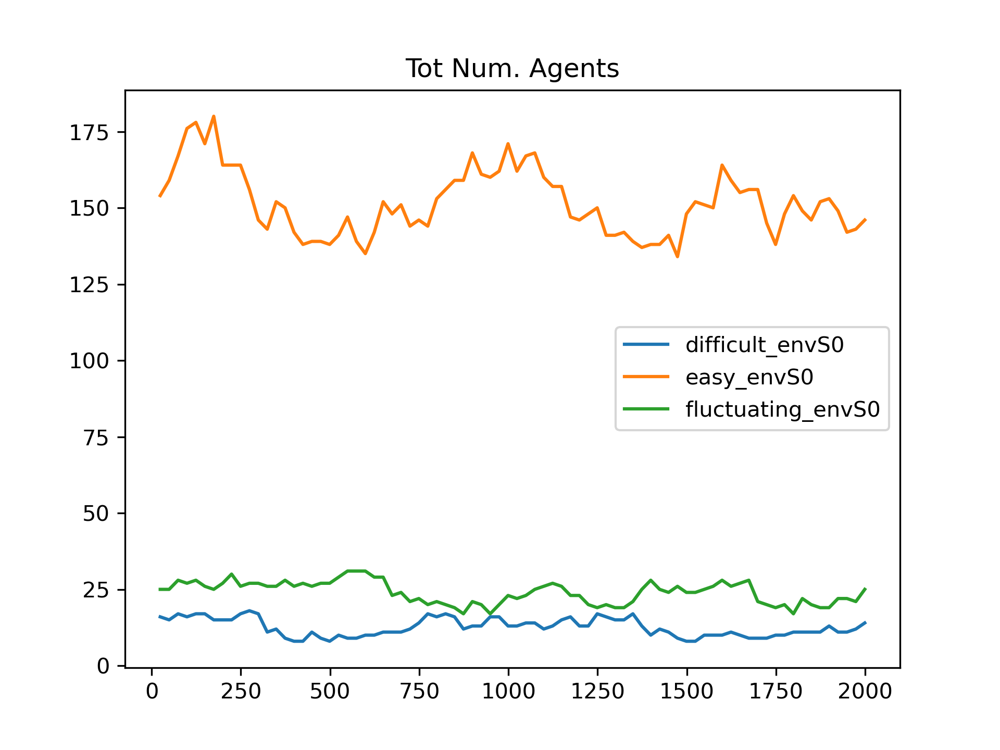
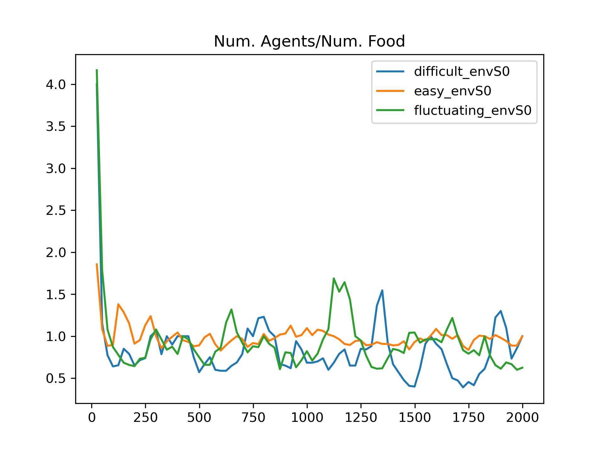

Experiment in `/experiments/diff_environments/run_pipeline.py`
My first experimental idea is something simple: checking whether training agents in different environment makes them "better". The way I define better is like this: take a population A evolved in environment A, and a population B evolved in environment B. When putting them together in a neutral environment C, A is better if after some time it replaces (or stronlgy dominate in frequency) population B. My hypothesis is that fluctuating environment, with their alternation of strong evolutionary pressure (during the hard times) and a possibility of higher exploration (during the easy times) would be the best. 

I have used 3 environments, which varied on the amount of food tokens they contained:
* Easy: 10000 steps with 200 food tokens 
* Difficult: since putting a low amount of food token wouldn't work as the population would get exctint, I first start with abudant environments and then shrink it to 75 food tokens.
* Fluctuating: cycles 3 times from 200 to 75 food tokens.

However, when tested together (I put them together in an averagely abundant environment), I couldn't find any particular pattern. I ran 10 seeds, and sometime even though one of the population almost always took over the other 2, it wasn't always the same population to win. 
The explanation I found is that the total amount of food token is not that important. What's important is the ratio is the ratio food token over population. On a difficult environment the carrying capacity is low, and from the initial population of 100 agents the equilibrium is about 17 agents.  On an easy environment the population goes from 100 (the initial amount of agents) to ~155 (Figure 1). With more food, the environment support more agents, and thus there is more competition to get the food and overall the amount of food available at any time per agent is the same across these environments! (Figure 2)

Someone suggested me to use random mortality as a way of changing the environment difficulty, which makes sense. That's probably gonna be my next experiment.



<noscript>Please enable JavaScript to view the <a href="https://disqus.com/?ref_noscript">comments powered by Disqus.</a></noscript>

